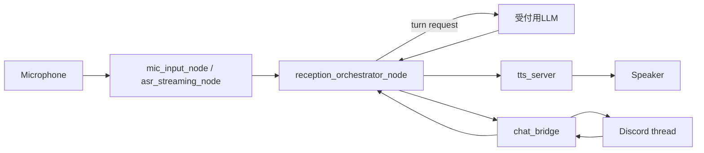
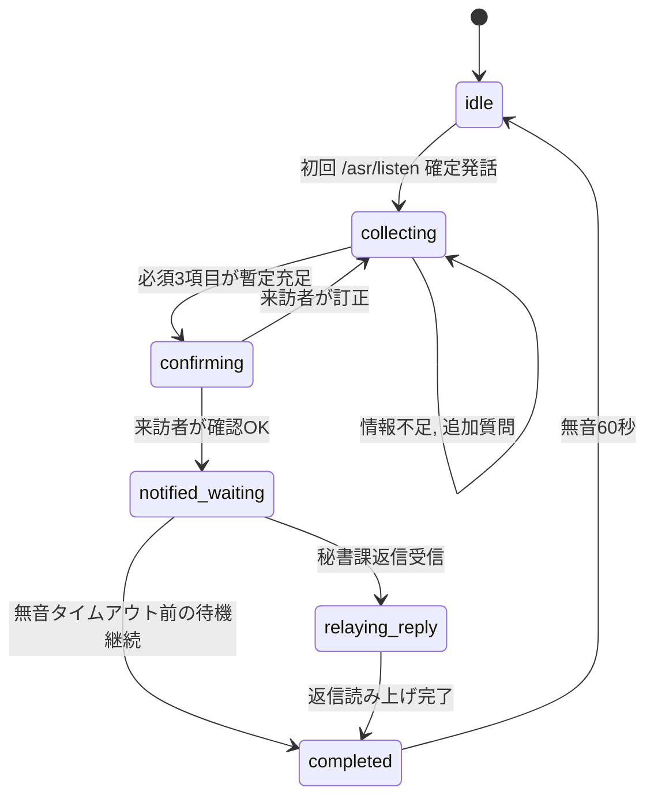

# 受付対応AIエージェントシステム, デモ版仕様書

## 1. 文書の目的

本書は, 大学の秘書課, 法人部への来訪者に対する一次受付を行う, 音声対話型AIエージェントシステムのデモ版を実装するための仕様書である.
目的は, 既存のROS 2ベース音声パッケージ群を活用し, Codexがそのまま実装可能な粒度で, オーケストレータノードの責務, 入出力, 状態遷移, 会話方針, Discord連携方式, 受け入れ条件を定義することにある.

本デモ版は, 後続のロボット実装を見据えて, 可能な限りROS 2ノードおよびROS 2インタフェースを中心に構成する.

## 2. システム概要

本システムは, 受付に設置されたマイク, PC, スピーカーのみで動作する, 画面なしの音声受付デモである.
来訪者が受付に話しかけると, ASRが発話を認識し, 単一の受付用LLMが発話理解と返答文生成を同時に行い, TTSが音声として再生する.
Discordスレッド作成, スレッド更新, 秘書課からの返信の取り込み, 追加質問の要否判断は, LLMの構造化出力を受けたオーケストレータの状態機械が行う.

来訪者から最低限取得すべき情報は, 名前, 所属, 来訪目的の3項目である.
これらが取得できた時点で, 内容を復唱確認したうえで, Discord上の来訪者専用スレッドへ定型フォーマットで送信する.
その後は, 秘書課からの返信をそのまま来訪者へ読み上げる, もしくは, 返信がなくても担当者へ連絡済みである旨を伝えて会話を終了する.

## 3. スコープ

### 3.1 対象

本デモ版の対象は以下に限定する.

- 大学の秘書課, 法人部への来訪者の一次対応
- 1対1の対話
- 日本語のみ
- マイク入力, スピーカー出力のみ
- 単一PC上で完結するローカル実行
- ROS 2ノードとして実装されるオーケストレータ
- Discordスレッドへの通知と, スレッド返信の読み上げ

### 3.2 非対象

本デモ版では以下は扱わない.

- 画面UI
- 管理画面
- 認証, 権限管理
- 個人情報保護や保存ポリシーの詳細設計
- 高可用性, 本番運用向けフォールバック
- 多人数同時対応
- 日本語以外の本格対応
- モバイルロボット制御やカメラ連携

## 4. 既存前提

既存のROS 2ワークスペースには, 少なくとも以下の機能パッケージが存在するものとする.

1. ASR系パッケージ
2. TTS系パッケージ
3. vLLM統合パッケージ
4. Discord通信用チャットSDK対応パッケージ

また, 現時点で明示的に結線済みなのは主に ASR の `mic_input_node -> asr_streaming_node` 系であり, `ASR -> LLM -> TTS -> Chat` を全体として束ねるオーケストレータノードは未実装である, という前提で設計する.

## 5. 開発方針

### 5.1 採用方針

実装の中心は, `rclpy` ベースの単一オーケストレータノードとする.
会話の主制御は, フレームワーク依存の大きいエージェントランタイムではなく, 明示的な状態機械として実装する.

推奨構成は以下とする.

- オーケストレーション本体: `rclpy` + `asyncio` + 明示的状態機械
- データモデル: 標準 `dataclasses`
- 監視, 判断担当LLMの構造化出力: JSON + 明示パース
- 受付用LLM呼び出し: 既存 `ros2_vllm` の `/llm/chat` または `/llm/stream/request` を利用
- Discord送信: 既存 `ros2_chat` の `/chat_bridge/create_thread`, `/chat_bridge/send_message` を利用
- TTS再生: 既存 `tts_server` の `/tts/speak` action を利用し, 必要に応じて `tts_server` 側のローカル再生機能を有効化する
- ASR入力: 既存 `asr_streaming_node` の `/asr/listen` action を正規入力として利用する

### 5.2 推奨理由

本件は, 低遅延で止まりにくい音声パイプラインが最優先である. そのため, オーケストレータ全体を重量級のエージェントフレームワークに寄せるより, ROSイベント駆動の明示的制御に寄せた方が安全である.
監視, 判断担当LLMについては, 構造化出力を JSON に限定し, オーケストレータ側で安全にパースする方針を推奨する.

LangGraphのようなグラフ実行系は, durable execution, human-in-the-loop, persistence が強みだが, 本デモ版では要求過多になりやすい. 本案件でまず必要なのは, 会話セッション管理, イベント監視, 非同期I/O, 低遅延応答, Discord同期であり, これらは `rclpy` + `asyncio` で十分に実現できる.

### 5.3 非推奨方針

以下はデモ版では推奨しない.

- オーケストレータ全体をLangChain中心で組むこと
- すべての判断をLLMの自由推論に委ねること
- 単一GPU環境で物理的に複数LLM backendを常駐させ, ASR/TTS の VRAM を圧迫すること
- 会話状態を自然言語ログだけで管理すること

## 6. 論理構成



## 7. コンポーネント責務

### 7.1 受付用LLM

受付用LLMは, 来訪者との自然な対話と, 発話の意味理解を同時に担当する.
責務は以下に限定する.

- ASR結果を受けて, 名前, 所属, 来訪目的, 訂正, 確認可否を JSON で返す
- 同時に, 来訪者へそのまま読み上げる短い返答文を生成する
- 返答は, 丁寧で自然な受付口調とし, 1〜2文に収める
- 複数質問や内部語を避け, 今必要なことだけを話す
- 秘書課から到着した返信を, 来訪者向け自然文にほぼそのまま変換して返答する

受付用LLMは, Discord送信, スレッド作成, 状態更新, phase 遷移, 重要フラグ判定などのツール実行責務を持たない.

### 7.2 オーケストレータの判断責務

Discord通知, スレッド作成, phase 遷移, 重複送信防止, stale 応答破棄, 将来の tool calling は, すべてオーケストレータの状態機械が担当する.
オーケストレータは LLM の構造化出力を検証し, canonical state に反映したうえで実際の I/O を決定する.

### 7.3 オーケストレータノード

オーケストレータは本システムの中核であり, 以下を責務とする.

- セッション開始, 継続, 終了の管理
- 収集済み情報の構造化状態管理
- `/asr/listen` action result 受信と発話確定テキストの取り込み
- 受付用LLM呼び出しとTTS出力制御
- LLM構造化出力の検証と結果反映
- Discordスレッド作成, 更新, 返信受信処理
- 復唱確認フロー制御
- 無音タイムアウトによるセッションリセット
- ログ出力
- 競合防止, 再入防止, 重複送信防止

## 8. セッションモデル

### 8.1 セッション開始条件

- `/asr/listen` の初回有効確定発話を受信した時点で新規セッションを開始する
- デモ版では同時セッションは扱わない
- セッションは常に1件だけ存在する

### 8.2 セッション終了条件

以下のいずれかで終了する.

1. 秘書課に連絡済みであることを来訪者へ伝え, 会話完了となった場合
2. 秘書課から返信を受け, その内容を来訪者へ伝え終えた場合
3. 会話終了後, 無音60秒が経過した場合

終了後は内部状態を初期化し, 待機状態へ戻る.

### 8.3 セッション中の保持状態

以下の構造化状態を保持する.

```python
@dataclass
class VisitorInfo:
    name: str | None = None
    affiliation: str | None = None
    purpose: str | None = None

@dataclass
class SessionState:
    session_id: str
    started_at: datetime
    last_activity_at: datetime
    phase: Literal[
        "idle",
        "collecting",
        "confirming",
        "notified_waiting",
        "relaying_reply",
        "completed",
    ]
    visitor_info: VisitorInfo
    conversation_history: list[dict]
    discord_thread_id: str | None = None
    discord_message_ts: str | None = None
    notified_initial: bool = False
    confirmation_done: bool = False
    secretary_replied: bool = False
```

## 9. 状態遷移



## 10. 会話仕様

### 10.1 話し方

受付用LLMの出力スタイルは, 丁寧, 愛想がよい, 受付らしい, 短く明快, を基本とする.
冗長な説明は避ける.
来訪者が高齢者や不慣れな話し方であっても, 急かさず, 優しく聞き返す.

### 10.2 基本フロー

基本フローは以下とする.

1. `/asr/listen` の初回確定発話を受ける
2. 名前, 所属, 来訪目的のうち不足項目を順次埋める
3. 3項目が揃ったら復唱確認する
4. 確認が取れたらDiscordスレッドに通知する
5. 「担当者へ連絡しました. 少々お待ちください」相当の案内を行う
6. 必要であれば秘書課からの返信を受けて来訪者へ伝える
7. 会話終了後, 無音60秒で待機へ戻る

### 10.3 復唱確認

Discord送信前に, 取得済み3項目を必ず音声で復唱確認する.
確認文の例を以下に示す.

`お名前は山田様, ご所属はABC株式会社, ご用件は学長との面会でお間違いないでしょうか.`

来訪者が訂正した場合は, 該当フィールドを更新し, 再確認する.

### 10.4 追加質問

必須3項目以外の情報が必要になった場合は, 秘書課からDiscordスレッド上で質問内容を返してもらい, その内容を対話担当LLMが自然な受付文にして来訪者へ再質問する.

### 10.5 秘書課返信の扱い

デモ版では, スレッド内の秘書課からの返信は原則そのまま来訪者へ読み上げ対象とする.
ただし, 実装上は以下の最低限のフィルタを設ける.

- 対象 thread に属する human-authored message のみを対象にする
- Bot自身, system message, self message は除外
- 空メッセージは除外
- 直近で読み上げ済みの同一メッセージは重複読み上げしない

## 11. 情報充足判定の仕様

情報充足判定は, デモ版では「ルールベース主, LLM補助」とする.

### 11.1 必須ルール

以下がすべて非空であれば, 必須情報充足とみなす.

- `visitor_info.name`
- `visitor_info.affiliation`
- `visitor_info.purpose`

### 11.2 LLM補助判定

監視, 判断担当LLMは, ASR誤認識や曖昧入力を補正するために以下を補助する.

- 名前らしい文字列の抽出
- 所属らしい文字列の抽出
- 来訪目的らしい文字列の抽出
- どの項目が不足しているかの判定
- 次に聞くべき質問の提案

ただし, 最終的な状態更新は, オーケストレータ側で構造化フィールドに落とし込んだ結果のみを採用する.

## 12. Discord連携仕様

### 12.1 スレッド作成タイミング

初回 `/asr/listen` 確定発話を受信した直後に, 非同期で専用スレッドを作成する.
thread 作成失敗時も音声主経路は継続し, 後続の会話処理を止めない.

### 12.2 初回投稿フォーマット

初回投稿は人間が読みやすい定型フォーマットとする. 例を以下に示す.

```text
【新規来訪】
セッションID: <session_id>
状態: collecting
名前: 未取得
所属: 未取得
来訪目的: 未取得
メモ: 来訪者が受付で会話を開始
```

### 12.3 更新投稿フォーマット

情報取得が進むたびに, 既存スレッドへ追記する. 例を以下に示す.

```text
【情報更新】
セッションID: <session_id>
状態: collecting
名前: 山田 太郎
所属: ABC株式会社
来訪目的: 学長との面会希望
不足項目: なし
```

### 12.4 確認後の通知

復唱確認が終わったら, 確定情報として再度投稿する.

```text
【受付内容確定】
セッションID: <session_id>
名前: 山田 太郎
所属: ABC株式会社
来訪目的: 学長との面会希望
受付AI: 来訪者への確認済み
```

### 12.5 返信受信

`/chat_bridge/incoming` から受信したメッセージのうち, 当該スレッドに属する未読 human-authored message のみを取り込み, 未読返信としてセッション状態に反映する.

## 13. レイテンシ要件

人間同士の会話では, 発話交替のギャップは非常に短く, 0〜200ms帯がもっとも多く, 日常会話の応答遅延中央値は300ms未満であることが知られている. ただし, 本システムは ASR -> LLM -> TTS の逐次処理を含むローカル音声パイプラインであるため, 人間同士の会話と同等の応答速度をそのまま要求するのは現実的ではない.

そのため, 本デモ版では以下を実用要件とする.

- 来訪者の発話終了から, AIの最初の音声出力開始までの目標値は 1.5秒以内
- 同上の許容上限は 3.0秒以内
- 4.0秒を超えるケースは体感品質を損なうため, 原則として避ける
- Discord送信や監視, 判断担当LLMの処理は, 対話担当LLMからTTSに至る主経路をブロックしてはならない
- Discord更新や監視系処理は, 可能な限りバックグラウンドタスクとして実行する

将来的に 3.0秒を超える応答が常態化する場合は, フィラー発話, たとえば `少々お待ちください` を早出しする軽量応答経路を追加してよい.

## 14. ROS 2 I/O要件

### 14.1 利用対象

既存ノードの詳細なメッセージ型は実装時に確認すること. ただし, 少なくとも以下の利用を前提とする.

| 種別 | 名前 | 用途 |
|---|---|---|
| Action | `/asr/listen` | 発話認識の取得 |
| Action | `/llm/chat` | 対話担当LLM呼び出し |
| Topic or Action | `/llm/stream/request`, `/llm/stream` | ストリーミング応答利用時 |
| Action | `/tts/speak` | 音声発話 |
| Service | `/chat_bridge/create_thread` | Discordスレッド作成 |
| Service | `/chat_bridge/send_message` | Discord送信 |
| Topic | `/chat_bridge/incoming` | Discord返信受信 |
| Topic | `/chat_bridge/status` | チャット接続状態監視 |

### 14.2 新規実装ノード

新規ノード名は `reception_orchestrator` とする.

### 14.3 新規ノードの主な責務

- `/asr/listen` action result を待ち受け, 発話確定をトリガに会話処理を進める
- 対話担当LLMへ要求を送る
- 応答をTTSへ送る
- Discordスレッド作成と更新を行う
- Discord返信を購読し, 対話へ反映する
- セッションタイムアウトを監視する

### 14.4 推奨追加インタフェース

実装簡易化のため, オーケストレータ内部だけで閉じるより, 将来的には以下の独自インタフェース追加を推奨する.

| 種別 | 例 | 目的 |
|---|---|---|
| Topic | `/reception/session_state` | 管理UIやデバッグ用状態配信 |
| Topic | `/reception/extracted_info` | 抽出済み構造化情報の配信 |
| Service | `/reception/reset_session` | 強制リセット |
| Topic | `/reception/events` | 主要イベントの監査ログ |

デモ版では必須ではないが, 実装しておくと拡張が容易になる.

## 15. オーケストレータ内部モジュール構成

オーケストレータは単一ノードでよいが, コード上は責務分離する.

```text
reception_orchestrator/
  __init__.py
  node.py
  session_manager.py
  state_models.py
  dialog_adapter.py
  supervisor_adapter.py
  discord_adapter.py
  info_extractor.py
  prompt_templates.py
  formatters.py
  dedup.py
```

### 15.1 `session_manager.py`

セッション状態の生成, 更新, 終了, リセットを担当する.

### 15.2 `state_models.py`

標準 `dataclasses` で `VisitorInfo`, `SessionState`, `SupervisorDecision` を定義する.

### 15.3 `dialog_adapter.py`

対話担当LLMへのプロンプト生成と呼び出しを行う.

### 15.4 `supervisor_adapter.py`

監視, 判断担当LLMの呼び出しを行う. 出力は JSON 文字列として受け, オーケストレータ側で構造化データへ変換する.

推奨出力例を以下に示す.

```python
@dataclass
class SupervisorDecision:
    missing_fields: list[Literal["name", "affiliation", "purpose"]]
    should_confirm: bool = False
    next_question_hint: str | None = None
    discord_update_summary: str | None = None
```

### 15.5 `discord_adapter.py`

スレッド作成, メッセージ送信, incoming購読, 重複返信除外を担当する.

### 15.6 `info_extractor.py`

ルールベースで最低限の情報抽出を行う. ここでは LLMを必須にしない. 例として, `私は株式会社Xの山田です`, `ABC社の田中です`, `面会に来ました` などから, 3項目候補を抽出する.

## 16. 実装ルール

### 16.1 優先原則

- 音声主経路を最優先する
- Discord連携は副経路として扱う
- 構造化状態を唯一の真実源とする
- 対話文と状態更新を分離する
- 監視, 判断担当LLMが落ちても最低限会話継続できるようにする

### 16.2 非同期実装原則

- TTS再生中でもDiscord incoming監視は継続する
- 監視, 判断担当LLMの呼び出しはバックグラウンドタスクとして主経路から分離する
- 同一セッションに対するDiscord重複投稿を抑制する
- セッション終了後に古いタスクが状態を書き換えないよう, `session_id` 一致確認を行う

### 16.3 冪等性

- Discord初回スレッド作成はセッションごとに1回まで
- 同一内容の情報更新投稿は抑制する
- 同一返信の読み上げは1回まで

## 17. 対話プロンプト方針

### 17.1 対話担当LLMプロンプト要件

以下を満たすこと.

- あなたは大学の受付担当AIである
- 丁寧で愛想のよい日本語で短く応答する
- 取得すべき必須情報は 名前, 所属, 来訪目的 の3つである
- 不足情報のみを優先して聞く
- 取得済み情報は何度も聞き直さない
- 情報が揃ったら必ず復唱確認する
- 確認完了後は「担当者へ連絡しました. 少々お待ちください」に近い案内を行う
- 秘書課からの返信は来訪者にわかる自然文でそのまま伝える

### 17.2 監視, 判断担当LLMプロンプト要件

以下を満たすこと.

- 自然な応答文ではなく, 構造化判断のみ返す
- 必須3項目の充足状況を返す
- Discord更新要否を返す
- 次に聞くべき情報があれば短いヒントを返す
- 不確かな推測は確定値として返さない

## 18. 失敗時の扱い, デモ版簡易仕様

本デモ版では高機能なフォールバックは要求しないが, 最低限以下だけ実装する.

- ASRで空文字列または無効入力の場合は, `恐れ入ります. もう一度お願いいたします.` と聞き返す
- 対話担当LLM失敗時は, 固定文で聞き返す
- Discord送信失敗時でも, 来訪者への会話は止めない
- TTS失敗時はログに残し, 次発話待ちへ戻る

## 19. 性能要件

### 19.1 実行環境

- 単一PC上で完結すること
- 開発, 実行環境は RTX 5090, VRAM 16GB 相当を前提とする
- 既存ASR, TTS, vLLM, Discord sidecar と共存可能であること

### 19.2 安定性

- 30分以上連続稼働してもセッション破綻しないこと
- 少なくとも連続10セッションを再起動なしで処理できること

## 20. 受け入れ条件

以下を満たした場合, デモ版完成とみなす.

1. マイク入力から来訪者発話を受け付けられる
2. AIが日本語で応答できる
3. 名前, 所属, 来訪目的の3項目を会話で取得できる
4. 取得後に復唱確認できる
5. セッション開始時にDiscordスレッドを作成できる
6. 情報更新をDiscordスレッドへ送信できる
7. 確認済みの3項目をDiscordへ定型フォーマットで通知できる
8. 秘書課からの返信を受け取り, 来訪者へ音声で伝えられる
9. 会話終了後, 無音60秒で初期状態へ戻る
10. Discord処理や監視, 判断担当LLM処理が, 音声主経路を顕著にブロックしない

## 21. 実装順序の推奨

Codex向けには, 以下の順で段階実装することを推奨する.

### Phase 1

- `reception_orchestrator` ノード骨組み作成
- セッション状態管理
- ASR確定文字列受信
- 対話担当LLM呼び出し
- TTS発話

### Phase 2

- ルールベース情報抽出
- 復唱確認フロー
- セッションタイムアウト

### Phase 3

- Discordスレッド作成
- Discord更新投稿
- Discord incoming購読
- 返信読み上げ

### Phase 4

- 監視, 判断担当LLM追加
- 構造化判断導入
- 情報不足判定の精度改善

## 22. 最終採用提案

本案件のデモ版に対する最終採用提案は以下とする.

- オーケストレータ本体は `rclpy` + `asyncio` + 明示的状態機械で実装する
- 状態モデルは標準 `dataclasses` で定義する
- 監視, 判断担当LLMは JSON 構造化出力のみを使う
- LangChain, LangGraph はデモ版初期実装では採用しない

この構成により, 音声主経路の低遅延, ROS 2との素直な統合, 将来のロボット化に向けた拡張性, Codexによる自動実装のしやすさを両立できる.
